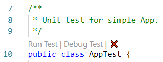
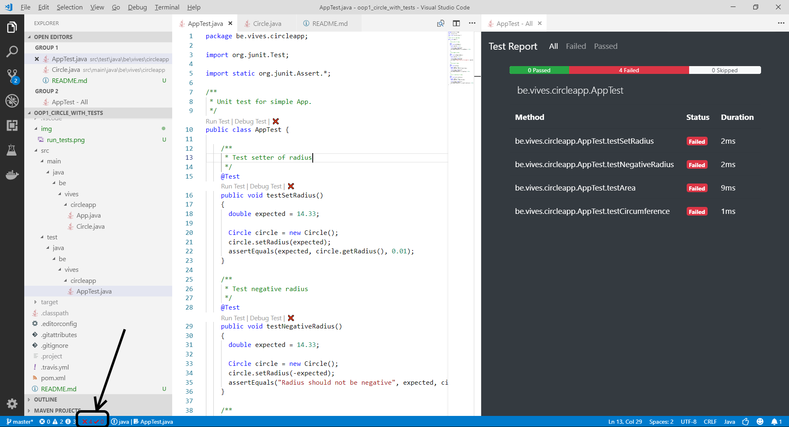

# Circle App with Tests

This is a basic example of an assignment with unit tests.

## Requirements

For this project to be runnable in VSCode, you will need to install `maven` as a command line tool. This is very easy using **chocolatey**:

```shell
choco install maven
```

## Starting

Just clone the repo and open vscode. You should give it a few seconds to setup.

Once finished traverse to `test/java/be/vives/circleapp/AppTest.java`.

You should now be able to run all the tests by selecting `Run Test` above the `AppTest` class as shown in the next image.



Once finished you should get the results at the bottom left corner. Click the results to get a more detailed overview.



You can click each test to a more detailed view of the error message.

If all tests pass, then your application should work as expected.

## Creating projects like this

This project was created with VSCode and the Java plugins (including Maven for Java). Next the `Generate from Maven archetype` command was used and the archetype `archetype-quickstart-jdk8`.